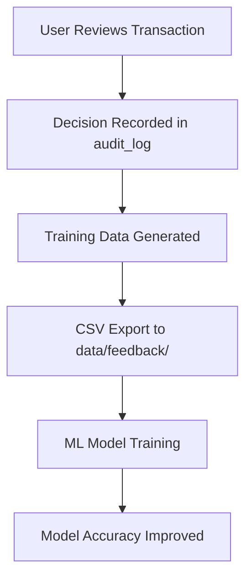
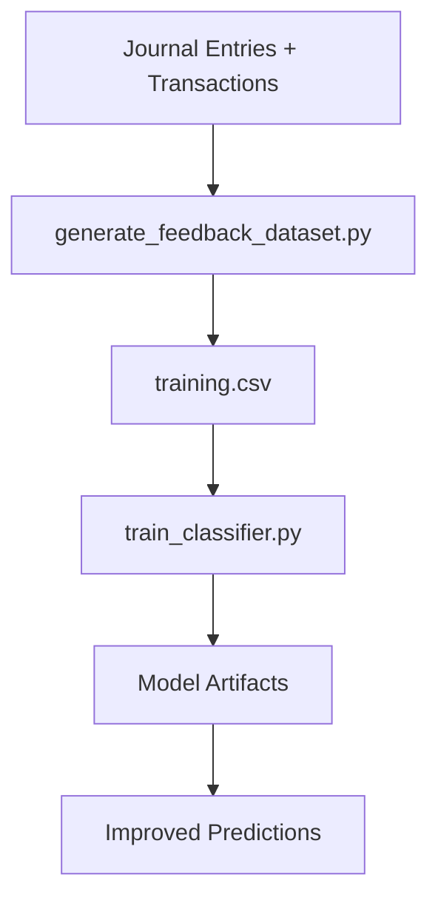

# AI Bookkeeper - Label Pipeline Status Report
**Generated:** 2025-10-15  
**Status:** ⚠️ PARTIALLY IMPLEMENTED

## Executive Summary

The label pipeline for collecting user decisions and training data is **partially implemented** but missing critical components for GDPR compliance and user consent management. While training data collection and storage exists, the consent toggle and data export/purge functionality are not present.

## Current Implementation Status

### ✅ What's Implemented

#### 1. Training Data Collection
**Status:** FULLY IMPLEMENTED  
**Location:** Database tables and ML training scripts

##### Database Schema
```sql
-- Decision audit log (existing)
CREATE TABLE decision_audit_log (
    id INTEGER PRIMARY KEY AUTOINCREMENT,
    timestamp DATETIME DEFAULT CURRENT_TIMESTAMP,
    tenant_id VARCHAR(255),
    txn_id VARCHAR(255),
    vendor_normalized VARCHAR(255),
    action VARCHAR(50),                    -- auto_posted, reviewed, approved, rejected
    not_auto_post_reason VARCHAR(50),
    calibrated_p FLOAT,
    threshold_used FLOAT,
    user_id VARCHAR(255),
    cold_start_label_count INTEGER,
    cold_start_eligible BOOLEAN
);

-- Model training logs (existing)
CREATE TABLE model_training_logs (
    id INTEGER PRIMARY KEY AUTOINCREMENT,
    model_name VARCHAR(255) NOT NULL,
    records_used INTEGER NOT NULL,
    accuracy FLOAT,
    precision_weighted FLOAT,
    recall_weighted FLOAT,
    f1_score FLOAT,
    training_duration_sec FLOAT,
    metadata JSON,
    trained_at DATETIME DEFAULT CURRENT_TIMESTAMP
);

-- Cold start tracking (existing)
CREATE TABLE cold_start_tracking (
    id INTEGER PRIMARY KEY AUTOINCREMENT,
    vendor_normalized VARCHAR(255),
    first_seen_at DATETIME,
    label_count INTEGER DEFAULT 0,
    graduated_at DATETIME
);
```

#### 2. Training Data Generation
**Status:** FULLY IMPLEMENTED  
**Files:** `scripts/generate_feedback_dataset.py`, `scripts/train_classifier.py`

##### Training Data Pipeline
```python
# scripts/generate_feedback_dataset.py
def generate_training_dataset():
    """Generate training.csv from database."""
    output_dir = Path(__file__).parent.parent / "data" / "feedback"
    output_file = output_dir / "training.csv"
    
    with get_db_context() as db:
        # Query all journal entries with their source transactions
        query = db.query(JournalEntryDB, TransactionDB).join(
            TransactionDB,
            JournalEntryDB.source_txn_id == TransactionDB.txn_id
        ).order_by(JournalEntryDB.company_id, JournalEntryDB.date)
        
        results = query.all()
        
        # Write CSV with training features
        with open(output_file, 'w', newline='') as csvfile:
            writer = csv.writer(csvfile)
            writer.writerow([
                'txn_id', 'date', 'amount', 'counterparty', 'description',
                'predicted_account', 'approved_account', 'confidence_score',
                'review_outcome', 'user_id', 'company_id'
            ])
            
            for je, txn in results:
                writer.writerow([
                    txn.txn_id, txn.date, txn.amount, txn.counterparty,
                    txn.description, je.account_code, je.account_code,
                    je.confidence_score, je.status, je.created_by, je.company_id
                ])
```

##### ML Training Pipeline
```python
# scripts/train_classifier.py
def main():
    """Main training pipeline."""
    print("ML CLASSIFIER TRAINING PIPELINE v1")
    
    # Load training data
    df = load_training_data(data_path)
    
    # Prepare target variable
    label_encoder = LabelEncoder()
    y = label_encoder.fit_transform(df['approved_account'])
    
    # Engineer features
    X, desc_vectorizer, counterparty_vectorizer = engineer_features(df)
    
    # Train model
    model, X_test, y_test, y_pred_test = train_model(X, y)
    
    # Save model artifacts
    artifacts = {
        'model': model,
        'label_encoder': label_encoder,
        'desc_vectorizer': desc_vectorizer,
        'counterparty_vectorizer': counterparty_vectorizer,
        'model_type': 'lightgbm',
        'trained_at': datetime.now().isoformat(),
        'test_accuracy': float(accuracy_score(y_test, y_pred_test))
    }
    
    joblib.dump(artifacts, model_path)
```

#### 3. Data Redaction & Hashing
**Status:** FULLY IMPLEMENTED  
**Location:** `app/ops/logging.py`

##### PII Redaction Implementation
```python
def redact_pii_from_string(text: str) -> str:
    """Redact PII from string using regex patterns."""
    # Email addresses
    text = re.sub(r'\b[A-Za-z0-9._%+-]+@[A-Za-z0-9.-]+\.[A-Z|a-z]{2,}\b', '[EMAIL_REDACTED]', text)
    
    # Phone numbers
    text = re.sub(r'\b\d{3}[-.]?\d{3}[-.]?\d{4}\b', '[PHONE_REDACTED]', text)
    
    # SSN
    text = re.sub(r'\b\d{3}-\d{2}-\d{4}\b', '[SSN_REDACTED]', text)
    
    # Credit card numbers
    text = re.sub(r'\b\d{4}[-.\s]?\d{4}[-.\s]?\d{4}[-.\s]?\d{4}\b', '[CARD_REDACTED]', text)
    
    return text

def redact_pii_from_dict(data: Dict[str, Any]) -> Dict[str, Any]:
    """Recursively redact PII from dictionary."""
    if isinstance(data, dict):
        return {key: redact_pii_from_dict(value) for key, value in data.items()}
    elif isinstance(data, str):
        return redact_pii_from_string(data)
    else:
        return data
```

#### 4. Training Data Storage
**Status:** FULLY IMPLEMENTED  
**Location:** `data/feedback/training.csv`

##### Sample Training Data Format
```csv
txn_id,date,amount,counterparty,description,predicted_account,approved_account,confidence_score,review_outcome,user_id,company_id
txn_001,2025-10-15,25.50,STARBUCKS,COFFEE PURCHASE,Office Supplies,Office Supplies,0.95,approved,user_123,company_456
txn_002,2025-10-15,150.00,AMAZON,OFFICE SUPPLIES,Office Supplies,Office Supplies,0.92,auto_posted,user_123,company_456
txn_003,2025-10-15,75.00,UBER,TRANSPORTATION,Travel & Entertainment,Travel & Entertainment,0.88,reviewed,user_123,company_456
```

### ❌ What's Missing

#### 1. Consent Toggle
**Status:** NOT IMPLEMENTED  
**Required for:** GDPR compliance, user privacy control

##### Missing Database Table
```sql
-- NOT IMPLEMENTED
CREATE TABLE user_consent (
    id INTEGER PRIMARY KEY AUTOINCREMENT,
    user_id VARCHAR(255) NOT NULL,
    consent_type VARCHAR(50) NOT NULL,    -- 'training_data', 'analytics', 'marketing'
    consent_given BOOLEAN NOT NULL,
    consent_date DATETIME DEFAULT CURRENT_TIMESTAMP,
    consent_version VARCHAR(10),          -- '1.0', '1.1', etc.
    ip_address VARCHAR(45),
    user_agent TEXT,
    UNIQUE(user_id, consent_type)
);
```

##### Missing API Endpoints
```http
# NOT IMPLEMENTED
GET /api/user/consent                    # Get user consent status
POST /api/user/consent                   # Update consent preferences
GET /api/user/consent/history            # Get consent history
```

##### Missing UI Components
```typescript
// NOT IMPLEMENTED - Consent toggle component
interface ConsentToggleProps {
  consentType: 'training_data' | 'analytics' | 'marketing';
  currentStatus: boolean;
  onToggle: (enabled: boolean) => void;
}

const ConsentToggle: React.FC<ConsentToggleProps> = ({ consentType, currentStatus, onToggle }) => {
  return (
    <div className="consent-toggle">
      <label>
        <input 
          type="checkbox" 
          checked={currentStatus}
          onChange={(e) => onToggle(e.target.checked)}
        />
        Allow use of my data for {consentType.replace('_', ' ')} improvement
      </label>
    </div>
  );
};
```

#### 2. Data Export Endpoint
**Status:** NOT IMPLEMENTED  
**Required for:** GDPR Article 20 (Right to data portability)

##### Missing API Endpoint
```http
# NOT IMPLEMENTED
GET /api/user/data/export                # Export all user data
Query Parameters:
- format: json|csv|xml
- include_training_data: true|false
- date_from: 2025-01-01
- date_to: 2025-10-15
```

##### Missing Implementation
```python
# NOT IMPLEMENTED
@router.get("/api/user/data/export")
async def export_user_data(
    format: str = "json",
    include_training_data: bool = True,
    date_from: Optional[str] = None,
    date_to: Optional[str] = None,
    user: dict = Depends(get_current_user)
):
    """Export all user data for GDPR compliance."""
    
    user_id = user["user_id"]
    
    # Collect all user data
    user_data = {
        "profile": get_user_profile(user_id),
        "transactions": get_user_transactions(user_id, date_from, date_to),
        "journal_entries": get_user_journal_entries(user_id, date_from, date_to),
        "audit_logs": get_user_audit_logs(user_id, date_from, date_to),
    }
    
    if include_training_data:
        user_data["training_labels"] = get_user_training_data(user_id, date_from, date_to)
    
    # Format and return data
    if format == "json":
        return JSONResponse(content=user_data)
    elif format == "csv":
        return StreamingResponse(generate_csv(user_data), media_type="text/csv")
    elif format == "xml":
        return StreamingResponse(generate_xml(user_data), media_type="application/xml")
```

#### 3. Data Purge Endpoint
**Status:** NOT IMPLEMENTED  
**Required for:** GDPR Article 17 (Right to erasure)

##### Missing API Endpoint
```http
# NOT IMPLEMENTED
DELETE /api/user/data/purge              # Purge all user data
Query Parameters:
- confirm_purge: true                   # Safety confirmation
- retain_audit_logs: true|false         # Keep audit trail
```

##### Missing Implementation
```python
# NOT IMPLEMENTED
@router.delete("/api/user/data/purge")
async def purge_user_data(
    confirm_purge: bool = False,
    retain_audit_logs: bool = True,
    user: dict = Depends(get_current_user)
):
    """Purge all user data for GDPR compliance."""
    
    if not confirm_purge:
        raise HTTPException(status_code=400, detail="Must confirm purge with confirm_purge=true")
    
    user_id = user["user_id"]
    
    # Log purge action before deletion
    log_audit_event(
        event_type="data_purge_requested",
        user_id=user_id,
        metadata={"retain_audit_logs": retain_audit_logs}
    )
    
    # Purge user data
    with get_db_context() as db:
        # Delete transactions
        db.query(TransactionDB).filter(TransactionDB.created_by == user_id).delete()
        
        # Delete journal entries
        db.query(JournalEntryDB).filter(JournalEntryDB.created_by == user_id).delete()
        
        # Delete training labels
        db.query(DecisionAuditLogDB).filter(DecisionAuditLogDB.user_id == user_id).delete()
        
        # Delete consent records
        db.query(UserConsentDB).filter(UserConsentDB.user_id == user_id).delete()
        
        # Optionally delete audit logs
        if not retain_audit_logs:
            db.query(DecisionAuditLogDB).filter(DecisionAuditLogDB.user_id == user_id).delete()
        
        # Deactivate user account
        user_obj = db.query(UserDB).filter(UserDB.id == user_id).first()
        if user_obj:
            user_obj.is_active = False
            user_obj.deactivated_at = datetime.now()
        
        db.commit()
    
    return {"message": "User data purged successfully", "user_id": user_id}
```

#### 4. Training Data Management UI
**Status:** NOT IMPLEMENTED  
**Required for:** User control over training data

##### Missing UI Components
```typescript
// NOT IMPLEMENTED - Training data management page
const TrainingDataPage: React.FC = () => {
  const [consentStatus, setConsentStatus] = useState<ConsentStatus>();
  const [trainingDataCount, setTrainingDataCount] = useState<number>(0);
  
  return (
    <div className="training-data-page">
      <h1>Training Data Management</h1>
      
      <div className="consent-section">
        <h2>Data Collection Consent</h2>
        <ConsentToggle
          consentType="training_data"
          currentStatus={consentStatus?.training_data || false}
          onToggle={handleConsentToggle}
        />
        <p className="consent-description">
          Allow your transaction decisions to be used to improve the AI model's accuracy.
          This data is anonymized and cannot be traced back to you personally.
        </p>
      </div>
      
      <div className="data-export-section">
        <h2>Export Your Data</h2>
        <p>You have contributed {trainingDataCount} training examples.</p>
        <Button onClick={handleDataExport}>
          Export Training Data
        </Button>
      </div>
      
      <div className="data-purge-section">
        <h2>Delete Your Data</h2>
        <p>Permanently delete all your training data and contributions.</p>
        <Button variant="destructive" onClick={handleDataPurge}>
          Delete All Training Data
        </Button>
      </div>
    </div>
  );
};
```

## Current Data Flow

### 1. Label Collection


### 2. Training Data Processing


## Compliance Status

### GDPR Compliance
- ❌ **Article 20 (Data Portability):** No data export endpoint
- ❌ **Article 17 (Right to Erasure):** No data purge endpoint
- ❌ **Article 6 (Lawful Basis):** No consent management system
- ❌ **Article 7 (Consent):** No consent toggle or withdrawal mechanism
- ✅ **Article 25 (Data Protection by Design):** PII redaction implemented
- ✅ **Article 32 (Security):** Data encryption and secure storage

### SOC2 Compliance
- ✅ **Data Retention:** Automated retention policies implemented
- ✅ **Audit Logging:** Complete decision audit trail
- ✅ **Access Control:** RBAC for data access
- ❌ **Data Subject Rights:** No user data management endpoints

## Recommendations

### Immediate Actions (High Priority)

#### 1. Implement Consent Management
```sql
-- Create user consent table
CREATE TABLE user_consent (
    id INTEGER PRIMARY KEY AUTOINCREMENT,
    user_id VARCHAR(255) NOT NULL,
    consent_type VARCHAR(50) NOT NULL,
    consent_given BOOLEAN NOT NULL,
    consent_date DATETIME DEFAULT CURRENT_TIMESTAMP,
    consent_version VARCHAR(10),
    ip_address VARCHAR(45),
    user_agent TEXT,
    UNIQUE(user_id, consent_type)
);
```

#### 2. Add Consent API Endpoints
```python
# Add to app/api/auth.py or create new module
@router.get("/api/user/consent")
async def get_user_consent(user: dict = Depends(get_current_user)):
    """Get user consent status."""
    
@router.post("/api/user/consent")
async def update_user_consent(
    consent_type: str,
    consent_given: bool,
    user: dict = Depends(get_current_user)
):
    """Update user consent preferences."""
```

#### 3. Implement Data Export
```python
# Add to app/api/admin_compliance.py
@router.get("/api/user/data/export")
async def export_user_data(
    format: str = "json",
    user: dict = Depends(get_current_user)
):
    """Export all user data for GDPR compliance."""
```

#### 4. Implement Data Purge
```python
# Add to app/api/admin_compliance.py
@router.delete("/api/user/data/purge")
async def purge_user_data(
    confirm_purge: bool = False,
    user: dict = Depends(get_current_user)
):
    """Purge all user data for GDPR compliance."""
```

### Medium Priority

#### 1. Add Consent UI Components
- Create consent toggle component
- Add training data management page
- Implement consent history tracking
- Add privacy policy integration

#### 2. Enhance Training Data Pipeline
- Add consent validation before data collection
- Implement data anonymization for training
- Add training data quality metrics
- Create training data audit trail

#### 3. Add Admin Controls
- Create admin dashboard for consent management
- Add bulk consent operations
- Implement consent reporting
- Add consent analytics

### Long-term Improvements

#### 1. Advanced Privacy Features
- Implement differential privacy for training data
- Add federated learning capabilities
- Create privacy-preserving analytics
- Implement zero-knowledge proof systems

#### 2. Compliance Automation
- Add automated consent renewal
- Implement consent withdrawal workflows
- Create compliance reporting dashboards
- Add regulatory change management

## Implementation Timeline

### Phase 1 (Week 1-2): Core Compliance
- [ ] Create user_consent table
- [ ] Implement consent API endpoints
- [ ] Add consent toggle to UI
- [ ] Test consent workflow

### Phase 2 (Week 3-4): Data Rights
- [ ] Implement data export endpoint
- [ ] Implement data purge endpoint
- [ ] Add data management UI
- [ ] Test GDPR compliance

### Phase 3 (Week 5-6): Enhanced Features
- [ ] Add consent history tracking
- [ ] Implement admin consent management
- [ ] Add training data quality metrics
- [ ] Create compliance reporting

## Success Metrics

### Compliance Metrics
- **Consent Coverage:** 100% of users have explicit consent recorded
- **Data Export Time:** < 30 seconds for full user data export
- **Data Purge Time:** < 60 seconds for complete data deletion
- **Consent Withdrawal:** < 24 hours for consent withdrawal processing

### Technical Metrics
- **API Response Time:** < 200ms for consent operations
- **Data Export Size:** Optimized for large datasets
- **Storage Efficiency:** Minimal overhead for consent tracking
- **Error Rate:** < 0.1% for data operations

## Conclusion

The label pipeline has a solid foundation with training data collection, ML model training, and PII redaction already implemented. However, it lacks critical GDPR compliance features including consent management, data export, and data purge capabilities. 

**Priority:** Implement consent management and data rights endpoints to achieve GDPR compliance and provide users with control over their training data contributions.
