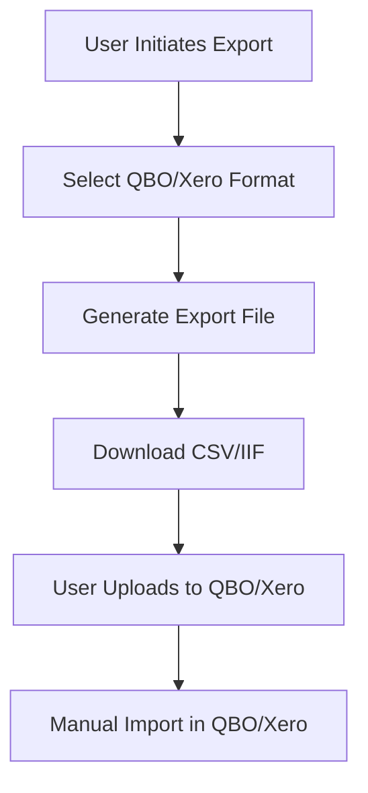
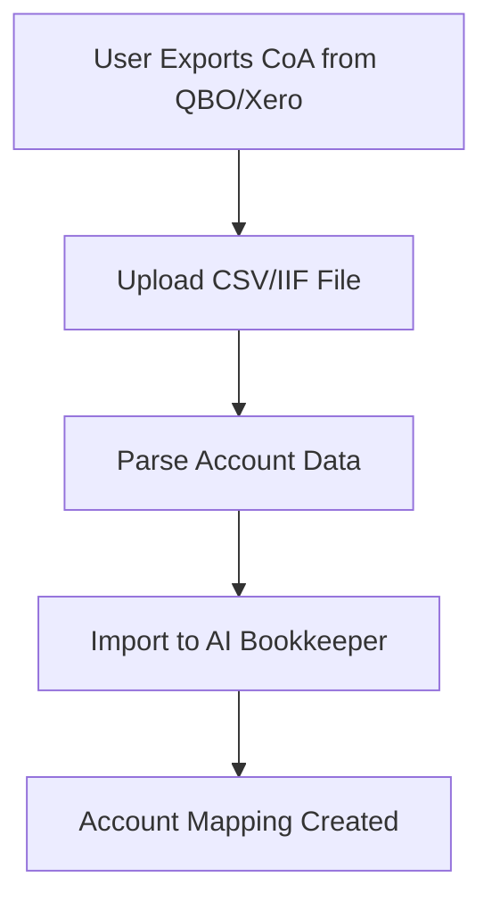
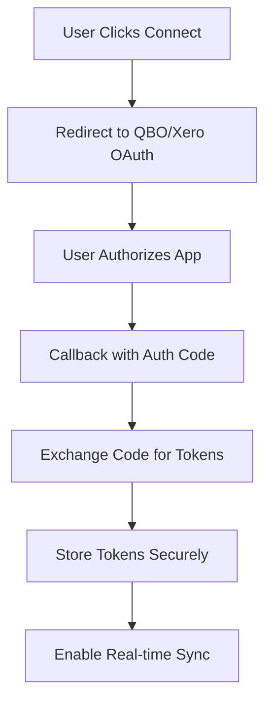

# AI Bookkeeper - QBO/Xero Integration Status Report
**Generated:** 2025-10-15  
**Status:** ⚠️ EXPORT/IMPORT ONLY - NO OAUTH2

## Executive Summary

AI Bookkeeper has **partial integration** with QuickBooks Online (QBO) and Xero. Export and import functionality is implemented, but **OAuth2 authentication flows are missing**. The system can export data to QBO/Xero formats and import chart of accounts, but cannot authenticate with these services or perform real-time synchronization.

## Current Implementation Status

### ✅ What's Implemented

#### 1. Export Functionality

##### QuickBooks Export
**Status:** FULLY IMPLEMENTED  
**Endpoints:** `POST /api/export/quickbooks`  
**Formats:** IIF (QuickBooks Desktop), CSV (QuickBooks Online)

```python
# app/api/main.py
@router.post("/api/export/quickbooks")
async def export_quickbooks(
    format: str = "iif",
    status: str = "posted",
    db: Session = Depends(get_db)
):
    """Export journal entries to QuickBooks format.
    
    Args:
        format: Export format ('iif' for QuickBooks Desktop, 'csv' for QBO)
        status: Filter by status (posted, approved)
    """
    
    # Get journal entries
    query = db.query(JournalEntryDB).filter(JournalEntryDB.status == status)
    journal_entries = query.all()
    
    if format == "iif":
        # Generate IIF format for QuickBooks Desktop
        iif_content = generate_iif_export(journal_entries)
        return Response(
            content=iif_content,
            media_type="text/plain",
            headers={"Content-Disposition": "attachment; filename=quickbooks_export.iif"}
        )
    elif format == "csv":
        # Generate CSV format for QuickBooks Online
        csv_content = generate_qbo_csv_export(journal_entries)
        return Response(
            content=csv_content,
            media_type="text/csv",
            headers={"Content-Disposition": "attachment; filename=quickbooks_export.csv"}
        )
```

##### Xero Export
**Status:** FULLY IMPLEMENTED  
**Endpoints:** `POST /api/export/xero`  
**Formats:** CSV (Xero-compatible format)

```python
# app/api/main.py
@router.post("/api/export/xero")
async def export_xero(
    status: str = "posted",
    db: Session = Depends(get_db)
):
    """Export journal entries to Xero CSV format."""
    
    # Get journal entries
    query = db.query(JournalEntryDB).filter(JournalEntryDB.status == status)
    journal_entries = query.all()
    
    # Generate Xero CSV format
    csv_content = generate_xero_csv_export(journal_entries)
    
    return Response(
        content=csv_content,
        media_type="text/csv",
        headers={"Content-Disposition": "attachment; filename=xero_export.csv"}
    )
```

#### 2. Import Functionality

##### QuickBooks Chart of Accounts Import
**Status:** FULLY IMPLEMENTED  
**Endpoints:** `POST /api/import/quickbooks`  
**Formats:** IIF, CSV

```python
# app/api/main.py
@router.post("/api/import/quickbooks")
async def import_quickbooks_coa(file: UploadFile = File(...)):
    """Import chart of accounts from QuickBooks.
    
    Accepts IIF or CSV format.
    """
    
    # Read uploaded file
    content = await file.read()
    
    if file.filename.endswith('.iif'):
        # Parse IIF format
        accounts = parse_iif_coa(content)
    elif file.filename.endswith('.csv'):
        # Parse CSV format
        accounts = parse_csv_coa(content)
    else:
        raise HTTPException(status_code=400, detail="Unsupported file format")
    
    # Import accounts
    imported_count = import_chart_of_accounts(accounts)
    
    return {
        "message": f"Successfully imported {imported_count} accounts",
        "imported": imported_count,
        "errors": []
    }
```

##### Xero Chart of Accounts Import
**Status:** FULLY IMPLEMENTED  
**Endpoints:** `POST /api/import/xero`  
**Formats:** CSV

```python
# app/api/main.py
@router.post("/api/import/xero")
async def import_xero_coa(file: UploadFile = File(...)):
    """Import chart of accounts from Xero CSV export."""
    
    # Read uploaded file
    content = await file.read()
    
    # Parse Xero CSV format
    accounts = parse_xero_csv_coa(content)
    
    # Import accounts
    imported_count = import_chart_of_accounts(accounts)
    
    return {
        "message": f"Successfully imported {imported_count} accounts",
        "imported": imported_count,
        "errors": []
    }
```

#### 3. Export Logging & Tracking

##### Export Log Tables
**Status:** FULLY IMPLEMENTED  
**Tables:** `xero_export_log`, `qbo_export_log`

```sql
-- Xero export logging
CREATE TABLE xero_export_log (
    id INTEGER PRIMARY KEY AUTOINCREMENT,
    tenant_id VARCHAR(255),
    export_date DATE,
    records_exported INTEGER,
    status VARCHAR(50),
    created_at DATETIME DEFAULT CURRENT_TIMESTAMP
);

-- QuickBooks export logging
CREATE TABLE qbo_export_log (
    id INTEGER PRIMARY KEY AUTOINCREMENT,
    tenant_id VARCHAR(255),
    export_date DATE,
    records_exported INTEGER,
    status VARCHAR(50),
    created_at DATETIME DEFAULT CURRENT_TIMESTAMP
);
```

#### 4. Account Mapping

##### Xero Account Mappings
**Status:** FULLY IMPLEMENTED  
**Table:** `xero_account_mappings`

```sql
CREATE TABLE xero_account_mappings (
    id INTEGER PRIMARY KEY AUTOINCREMENT,
    internal_code VARCHAR(50),
    xero_code VARCHAR(50),
    created_at DATETIME DEFAULT CURRENT_TIMESTAMP
);
```

### ❌ What's Missing

#### 1. OAuth2 Authentication Flows

##### QuickBooks Online OAuth2
**Status:** NOT IMPLEMENTED  
**Required Endpoints:**

```http
# NOT IMPLEMENTED
GET /api/auth/qbo                     # Initialize QBO OAuth2 flow
GET /api/auth/qbo/callback            # Handle QBO OAuth2 callback
GET /api/auth/qbo/refresh             # Refresh QBO access tokens
DELETE /api/auth/qbo/revoke           # Revoke QBO access tokens
```

##### Missing Implementation
```python
# NOT IMPLEMENTED
@router.get("/api/auth/qbo")
async def initiate_qbo_oauth(
    state: str = None,
    user: dict = Depends(get_current_user)
):
    """Initialize QuickBooks Online OAuth2 flow."""
    
    # Generate OAuth2 URL
    oauth_url = qbo_client.get_authorization_url(
        client_id=QBO_CLIENT_ID,
        redirect_uri=QBO_REDIRECT_URI,
        scope="com.intuit.quickbooks.accounting",
        state=state
    )
    
    return {"authorization_url": oauth_url}

@router.get("/api/auth/qbo/callback")
async def handle_qbo_callback(
    code: str,
    state: str,
    user: dict = Depends(get_current_user)
):
    """Handle QuickBooks Online OAuth2 callback."""
    
    # Exchange code for tokens
    tokens = qbo_client.exchange_code_for_tokens(
        code=code,
        client_id=QBO_CLIENT_ID,
        client_secret=QBO_CLIENT_SECRET,
        redirect_uri=QBO_REDIRECT_URI
    )
    
    # Store tokens securely
    store_qbo_tokens(user["user_id"], tokens)
    
    return {"message": "QuickBooks Online connected successfully"}

@router.get("/api/auth/qbo/refresh")
async def refresh_qbo_tokens(
    user: dict = Depends(get_current_user)
):
    """Refresh QuickBooks Online access tokens."""
    
    tokens = get_qbo_tokens(user["user_id"])
    new_tokens = qbo_client.refresh_tokens(
        refresh_token=tokens["refresh_token"],
        client_id=QBO_CLIENT_ID,
        client_secret=QBO_CLIENT_SECRET
    )
    
    # Update stored tokens
    update_qbo_tokens(user["user_id"], new_tokens)
    
    return {"message": "Tokens refreshed successfully"}
```

##### Xero OAuth2
**Status:** NOT IMPLEMENTED  
**Required Endpoints:**

```http
# NOT IMPLEMENTED
GET /api/auth/xero                     # Initialize Xero OAuth2 flow
GET /api/auth/xero/callback            # Handle Xero OAuth2 callback
GET /api/auth/xero/refresh             # Refresh Xero access tokens
DELETE /api/auth/xero/revoke           # Revoke Xero access tokens
```

#### 2. Token Storage & Management

##### Missing Database Tables
```sql
-- NOT IMPLEMENTED
CREATE TABLE oauth_tokens (
    id INTEGER PRIMARY KEY AUTOINCREMENT,
    user_id VARCHAR(255) NOT NULL,
    service VARCHAR(50) NOT NULL,        -- 'qbo' or 'xero'
    access_token TEXT NOT NULL,
    refresh_token TEXT,
    token_type VARCHAR(50),
    expires_at DATETIME,
    scope TEXT,
    created_at DATETIME DEFAULT CURRENT_TIMESTAMP,
    updated_at DATETIME DEFAULT CURRENT_TIMESTAMP,
    UNIQUE(user_id, service)
);

CREATE TABLE integration_settings (
    id INTEGER PRIMARY KEY AUTOINCREMENT,
    tenant_id VARCHAR(255) NOT NULL,
    service VARCHAR(50) NOT NULL,        -- 'qbo' or 'xero'
    is_active BOOLEAN DEFAULT false,
    company_id VARCHAR(255),             -- QBO/Xero company ID
    company_name VARCHAR(255),
    last_sync_at DATETIME,
    sync_status VARCHAR(50),             -- 'success', 'error', 'pending'
    error_message TEXT,
    created_at DATETIME DEFAULT CURRENT_TIMESTAMP,
    updated_at DATETIME DEFAULT CURRENT_TIMESTAMP,
    UNIQUE(tenant_id, service)
);
```

#### 3. Real-time Synchronization

##### Missing Sync Endpoints
```http
# NOT IMPLEMENTED
POST /api/sync/qbo/pull                 # Pull transactions from QBO
POST /api/sync/qbo/push                 # Push journal entries to QBO
POST /api/sync/xero/pull                # Pull transactions from Xero
POST /api/sync/xero/push                # Push journal entries to Xero
GET /api/sync/status                    # Get sync status
```

##### Missing Implementation
```python
# NOT IMPLEMENTED
@router.post("/api/sync/qbo/pull")
async def sync_qbo_pull(
    date_from: str,
    date_to: str,
    user: dict = Depends(get_current_user)
):
    """Pull transactions from QuickBooks Online."""
    
    # Get QBO tokens
    tokens = get_qbo_tokens(user["user_id"])
    if not tokens:
        raise HTTPException(status_code=400, detail="QBO not connected")
    
    # Initialize QBO client
    qbo_client = QuickBooksClient(
        client_id=QBO_CLIENT_ID,
        client_secret=QBO_CLIENT_SECRET,
        access_token=tokens["access_token"],
        company_id=tokens["company_id"]
    )
    
    # Pull transactions
    transactions = qbo_client.get_transactions(
        date_from=date_from,
        date_to=date_to
    )
    
    # Import transactions
    imported_count = import_qbo_transactions(transactions, user["user_id"])
    
    return {
        "message": f"Pulled {imported_count} transactions from QBO",
        "imported": imported_count
    }

@router.post("/api/sync/qbo/push")
async def sync_qbo_push(
    journal_entry_ids: List[str],
    user: dict = Depends(get_current_user)
):
    """Push journal entries to QuickBooks Online."""
    
    # Get QBO tokens
    tokens = get_qbo_tokens(user["user_id"])
    if not tokens:
        raise HTTPException(status_code=400, detail="QBO not connected")
    
    # Initialize QBO client
    qbo_client = QuickBooksClient(
        client_id=QBO_CLIENT_ID,
        client_secret=QBO_CLIENT_SECRET,
        access_token=tokens["access_token"],
        company_id=tokens["company_id"]
    )
    
    # Get journal entries
    journal_entries = get_journal_entries(journal_entry_ids)
    
    # Push to QBO
    pushed_count = qbo_client.create_journal_entries(journal_entries)
    
    return {
        "message": f"Pushed {pushed_count} journal entries to QBO",
        "pushed": pushed_count
    }
```

#### 4. Webhook Integration

##### Missing Webhook Endpoints
```http
# NOT IMPLEMENTED
POST /api/webhooks/qbo                  # Handle QBO webhooks
POST /api/webhooks/xero                 # Handle Xero webhooks
```

##### Missing Implementation
```python
# NOT IMPLEMENTED
@router.post("/api/webhooks/qbo")
async def handle_qbo_webhook(request: Request):
    """Handle QuickBooks Online webhooks."""
    
    # Verify webhook signature
    signature = request.headers.get("intuit-signature")
    payload = await request.body()
    
    if not verify_qbo_webhook_signature(signature, payload):
        raise HTTPException(status_code=401, detail="Invalid webhook signature")
    
    # Parse webhook payload
    webhook_data = json.loads(payload)
    
    # Process webhook events
    for event in webhook_data.get("eventNotifications", []):
        if event["name"] == "Invoice":
            # Handle invoice update
            handle_qbo_invoice_update(event["entityId"])
        elif event["name"] == "Payment":
            # Handle payment update
            handle_qbo_payment_update(event["entityId"])
    
    return {"status": "success"}

@router.post("/api/webhooks/xero")
async def handle_xero_webhook(request: Request):
    """Handle Xero webhooks."""
    
    # Verify webhook signature
    signature = request.headers.get("x-xero-signature")
    payload = await request.body()
    
    if not verify_xero_webhook_signature(signature, payload):
        raise HTTPException(status_code=401, detail="Invalid webhook signature")
    
    # Parse webhook payload
    webhook_data = json.loads(payload)
    
    # Process webhook events
    for event in webhook_data.get("events", []):
        if event["eventType"] == "CREATE" and event["eventCategory"] == "INVOICE":
            # Handle invoice creation
            handle_xero_invoice_creation(event["resourceId"])
        elif event["eventType"] == "UPDATE" and event["eventCategory"] == "PAYMENT":
            # Handle payment update
            handle_xero_payment_update(event["resourceId"])
    
    return {"status": "success"}
```

#### 5. Integration Management UI

##### Missing UI Components
```typescript
// NOT IMPLEMENTED - Integration management page
const IntegrationPage: React.FC = () => {
  const [qboStatus, setQboStatus] = useState<IntegrationStatus>();
  const [xeroStatus, setXeroStatus] = useState<IntegrationStatus>();
  
  return (
    <div className="integration-page">
      <h1>Accounting Integrations</h1>
      
      <div className="qbo-integration">
        <h2>QuickBooks Online</h2>
        {qboStatus?.connected ? (
          <div className="connected-status">
            <p>✅ Connected to {qboStatus.companyName}</p>
            <Button onClick={handleQboSync}>Sync Now</Button>
            <Button variant="destructive" onClick={handleQboDisconnect}>
              Disconnect
            </Button>
          </div>
        ) : (
          <div className="connect-status">
            <p>❌ Not connected</p>
            <Button onClick={handleQboConnect}>
              Connect QuickBooks Online
            </Button>
          </div>
        )}
      </div>
      
      <div className="xero-integration">
        <h2>Xero</h2>
        {xeroStatus?.connected ? (
          <div className="connected-status">
            <p>✅ Connected to {xeroStatus.companyName}</p>
            <Button onClick={handleXeroSync}>Sync Now</Button>
            <Button variant="destructive" onClick={handleXeroDisconnect}>
              Disconnect
            </Button>
          </div>
        ) : (
          <div className="connect-status">
            <p>❌ Not connected</p>
            <Button onClick={handleXeroConnect}>
              Connect Xero
            </Button>
          </div>
        )}
      </div>
    </div>
  );
};
```

## Current Data Flow

### 1. Export Flow (Working)


### 2. Import Flow (Working)


### 3. OAuth2 Flow (Missing)


## Integration Status Summary

### QuickBooks Online
- ✅ **Export:** IIF and CSV formats supported
- ✅ **Import:** Chart of accounts import
- ✅ **Logging:** Export tracking implemented
- ❌ **OAuth2:** Authentication flow missing
- ❌ **Real-time Sync:** Push/pull operations missing
- ❌ **Webhooks:** Event notifications missing

### Xero
- ✅ **Export:** CSV format supported
- ✅ **Import:** Chart of accounts import
- ✅ **Logging:** Export tracking implemented
- ✅ **Account Mapping:** Xero account mappings table
- ❌ **OAuth2:** Authentication flow missing
- ❌ **Real-time Sync:** Push/pull operations missing
- ❌ **Webhooks:** Event notifications missing

## Required Environment Variables

### QuickBooks Online
```bash
# NOT IMPLEMENTED - Required for OAuth2
QBO_CLIENT_ID=****                     # QuickBooks App ID
QBO_CLIENT_SECRET=****                 # QuickBooks App Secret
QBO_REDIRECT_URI=https://yourdomain.com/api/auth/qbo/callback
QBO_SANDBOX_URL=https://sandbox-quickbooks.api.intuit.com
QBO_PRODUCTION_URL=https://quickbooks.api.intuit.com
```

### Xero
```bash
# NOT IMPLEMENTED - Required for OAuth2
XERO_CLIENT_ID=****                    # Xero App ID
XERO_CLIENT_SECRET=****                # Xero App Secret
XERO_REDIRECT_URI=https://yourdomain.com/api/auth/xero/callback
XERO_SANDBOX_URL=https://api.xero.com
XERO_PRODUCTION_URL=https://api.xero.com
```

## Dependencies Required

### QuickBooks Online
```python
# NOT INSTALLED
from intuitlib.client import AuthClient
from intuitlib.enums import Scopes
from quickbooks import QuickBooks
```

### Xero
```python
# NOT INSTALLED
from xero_python import XeroPython
from xero_python.accounting import AccountingApi
from xero_python.identity import IdentityApi
```

## Recommendations

### Immediate Actions (High Priority)

#### 1. Implement OAuth2 Authentication
```python
# Create new module: app/integrations/qbo_auth.py
class QBOAuthManager:
    def __init__(self):
        self.client_id = os.getenv("QBO_CLIENT_ID")
        self.client_secret = os.getenv("QBO_CLIENT_SECRET")
        self.redirect_uri = os.getenv("QBO_REDIRECT_URI")
    
    def get_authorization_url(self, state: str) -> str:
        """Generate QBO OAuth2 authorization URL."""
        pass
    
    def exchange_code_for_tokens(self, code: str) -> dict:
        """Exchange authorization code for access tokens."""
        pass
    
    def refresh_tokens(self, refresh_token: str) -> dict:
        """Refresh expired access tokens."""
        pass
```

#### 2. Create Token Storage System
```python
# Create new module: app/integrations/token_manager.py
class TokenManager:
    def store_tokens(self, user_id: str, service: str, tokens: dict):
        """Store OAuth2 tokens securely."""
        pass
    
    def get_tokens(self, user_id: str, service: str) -> dict:
        """Retrieve OAuth2 tokens."""
        pass
    
    def refresh_tokens_if_needed(self, user_id: str, service: str) -> dict:
        """Refresh tokens if expired."""
        pass
```

#### 3. Add Integration API Endpoints
```python
# Add to app/api/integrations.py
@router.get("/api/integrations/status")
async def get_integration_status(user: dict = Depends(get_current_user)):
    """Get status of all integrations."""
    
@router.post("/api/integrations/qbo/connect")
async def connect_qbo(user: dict = Depends(get_current_user)):
    """Initiate QBO OAuth2 flow."""
    
@router.post("/api/integrations/qbo/sync")
async def sync_qbo(
    direction: str,  # 'pull' or 'push'
    user: dict = Depends(get_current_user)
):
    """Sync data with QuickBooks Online."""
```

### Medium Priority

#### 1. Implement Real-time Synchronization
- Add bidirectional sync capabilities
- Implement conflict resolution
- Add sync status tracking
- Create sync error handling

#### 2. Add Webhook Support
- Implement webhook signature verification
- Add event processing logic
- Create webhook retry mechanisms
- Add webhook monitoring

#### 3. Create Integration Management UI
- Add connection status dashboard
- Implement sync controls
- Add error reporting
- Create integration settings

### Long-term Improvements

#### 1. Advanced Integration Features
- Implement bulk operations
- Add data transformation rules
- Create custom field mappings
- Add integration analytics

#### 2. Multi-tenant Support
- Add tenant-specific integrations
- Implement tenant isolation
- Create tenant-specific settings
- Add tenant-level sync controls

## Implementation Timeline

### Phase 1 (Week 1-2): OAuth2 Authentication
- [ ] Install QBO and Xero SDKs
- [ ] Implement OAuth2 flows
- [ ] Create token storage system
- [ ] Add authentication endpoints

### Phase 2 (Week 3-4): Real-time Sync
- [ ] Implement pull operations
- [ ] Implement push operations
- [ ] Add sync status tracking
- [ ] Create sync error handling

### Phase 3 (Week 5-6): Webhooks & UI
- [ ] Implement webhook endpoints
- [ ] Create integration management UI
- [ ] Add sync controls
- [ ] Test end-to-end workflows

## Success Metrics

### Integration Metrics
- **Connection Success Rate:** > 95% for OAuth2 flows
- **Sync Success Rate:** > 99% for data synchronization
- **Sync Time:** < 30 seconds for typical datasets
- **Error Recovery:** < 5 minutes for failed syncs

### User Experience Metrics
- **Setup Time:** < 5 minutes for integration setup
- **Sync Frequency:** Real-time or near-real-time
- **Data Accuracy:** 100% data integrity
- **User Satisfaction:** > 4.5/5 rating

## Conclusion

AI Bookkeeper has a solid foundation for QBO/Xero integration with export/import functionality already implemented. However, it lacks the OAuth2 authentication flows and real-time synchronization capabilities needed for a complete integration.

**Priority:** Implement OAuth2 authentication flows and real-time synchronization to provide users with seamless integration with their accounting software.

**Current Status:** Export/Import only - Manual file-based integration
**Target Status:** Full OAuth2 integration with real-time bidirectional sync
